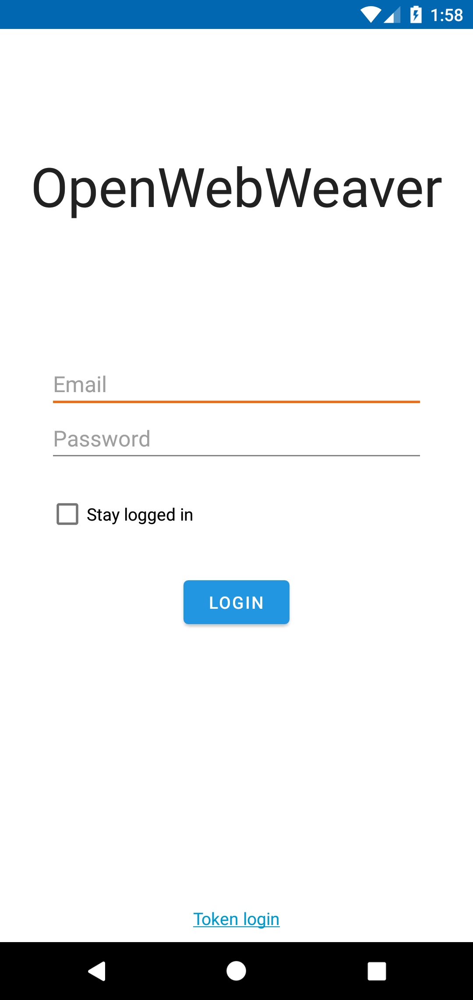
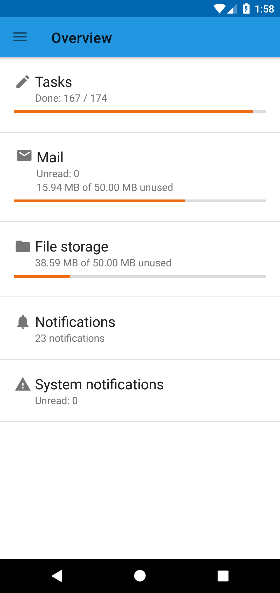
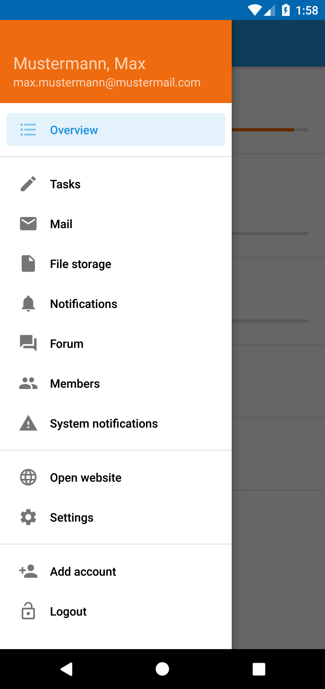

# OpenWebWeaver

Unofficial WebWeaver® app for Android

## Download

<a href="https://f-droid.org/packages/de.deftk.openww.android/">

## Screenshots

## Disclaimer
This project is neither authorized nor endorsed by DigiOnline GmbH (WebWeaver®).
